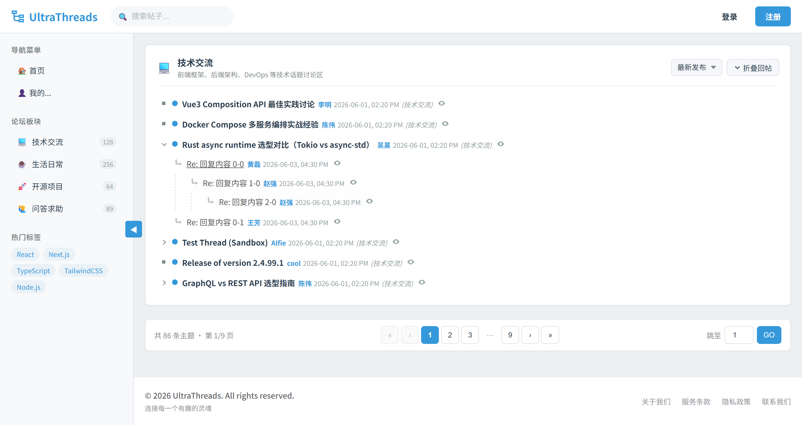

# UltraThreads

`UltraThreads` is an open-source, lightweight web forum that renders posts in threaded view.

## Features

- data storage in a MySQL or SQLite database
- nodes
- three possible views of posts

## Project Structure

### api

> Developed with `Go`, providing RESTful-style APIs.

*Tech Stack*
- gin (https://github.com/gin-gonic/gin) Go web framework
- JWT (https://github.com/appleboy/gin-jwt) JWT Middleware for Gin framework
- gorm (http://gorm.io/) ORM framework for Go language

### web

> Frontend page rendering service implemented based on `Next.js`.

*Tech Stack*
- Next.js (https://nextjs.org) The React Framework for the Web

## Installation

The project is still in early development. Refer to the README files of the `api` and `web` modules for installation and development instructions.

## Demo

`
📌 [ID:1] Go (ParentId:0, ThreadId:1)
├── 💬 [ID:11] Reply to Go (ParentId:1, ThreadId:1)
│   └── 💬 [ID:12] Nested reply (ParentId:11, ThreadId:1)
├── 💬 [ID:13] Another reply (ParentId:1, ThreadId:1)
└── 💬 [ID:14] Third reply (ParentId:1, ThreadId:1)

📌 [ID:2] Rust (ParentId:0, ThreadId:2)
├── 💬 [ID:15] Reply to Rust (ParentId:2, ThreadId:2)
├── 💬 [ID:16] Second reply (ParentId:2, ThreadId:2)
│   └── 💬 [ID:17] Nested reply (ParentId:16, ThreadId:2)
├── 💬 [ID:18] Third reply (ParentId:2, ThreadId:2)
└── 💬 [ID:19] Fourth reply (ParentId:2, ThreadId:2)

📌 [ID:3] Python (ParentId:0, ThreadId:3)
├── 💬 [ID:20] Reply to Python (ParentId:3, ThreadId:3)
└── 💬 [ID:21] Second reply (ParentId:3, ThreadId:3)

📌 [ID:4] Java (ParentId:0, ThreadId:4)
├── 💬 [ID:22] Reply to Java (ParentId:4, ThreadId:4)
│   └── 💬 [ID:23] Nested reply (ParentId:22, ThreadId:4)
├── 💬 [ID:24] Second reply (ParentId:4, ThreadId:4)
├── 💬 [ID:25] Third reply (ParentId:4, ThreadId:4)
└── 💬 [ID:26] Fourth reply (ParentId:4, ThreadId:4)
    └── 💬 [ID:27] Deep nested (ParentId:26, ThreadId:4)

📌 [ID:5] TypeScript (ParentId:0, ThreadId:5)
├── 💬 [ID:28] Reply to TypeScript (ParentId:5, ThreadId:5)
├── 💬 [ID:29] Second reply (ParentId:5, ThreadId:5)
└── 💬 [ID:30] Third reply (ParentId:5, ThreadId:5)

📌 [ID:6] C++ (ParentId:0, ThreadId:6)
├── 💬 [ID:31] Reply to C++ (ParentId:6, ThreadId:6)
│   └── 💬 [ID:32] Nested reply (ParentId:31, ThreadId:6)
├── 💬 [ID:33] Second reply (ParentId:6, ThreadId:6)
├── 💬 [ID:34] Third reply (ParentId:6, ThreadId:6)
├── 💬 [ID:35] Fourth reply (ParentId:6, ThreadId:6)
└── 💬 [ID:36] Fifth reply (ParentId:6, ThreadId:6)

📌 [ID:7] Kotlin (ParentId:0, ThreadId:7)
├── 💬 [ID:37] Reply to Kotlin (ParentId:7, ThreadId:7)
└── 💬 [ID:38] Second reply (ParentId:7, ThreadId:7)
    └── 💬 [ID:39] Nested reply (ParentId:38, ThreadId:7)

📌 [ID:8] Swift (ParentId:0, ThreadId:8)
├── 💬 [ID:40] Reply to Swift (ParentId:8, ThreadId:8)
├── 💬 [ID:41] Second reply (ParentId:8, ThreadId:8)
├── 💬 [ID:42] Third reply (ParentId:8, ThreadId:8)
└── 💬 [ID:43] Fourth reply (ParentId:8, ThreadId:8)

📌 [ID:9] Zig (ParentId:0, ThreadId:9)
├── 💬 [ID:44] Reply to Zig (ParentId:9, ThreadId:9)
│   └── 💬 [ID:45] Nested reply (ParentId:44, ThreadId:9)
├── 💬 [ID:46] Second reply (ParentId:9, ThreadId:9)
└── 💬 [ID:47] Third reply (ParentId:9, ThreadId:9)

📌 [ID:10] Haskell (ParentId:0, ThreadId:10)
├── 💬 [ID:48] Reply to Haskell (ParentId:10, ThreadId:10)
├── 💬 [ID:49] Second reply (ParentId:10, ThreadId:10)
├── 💬 [ID:50] Third reply (ParentId:10, ThreadId:10)
├── 💬 [ID:51] Fourth reply (ParentId:10, ThreadId:10)
└── 💬 [ID:52] Fifth reply (ParentId:10, ThreadId:10)
    └── 💬 [ID:53] Deep nested (ParentId:52, ThreadId:10)
`

## License
UltraThreads is open-sourced software licensed under the [GNU General Public License version 3](https://opensource.org/license/gpl-3.0)

